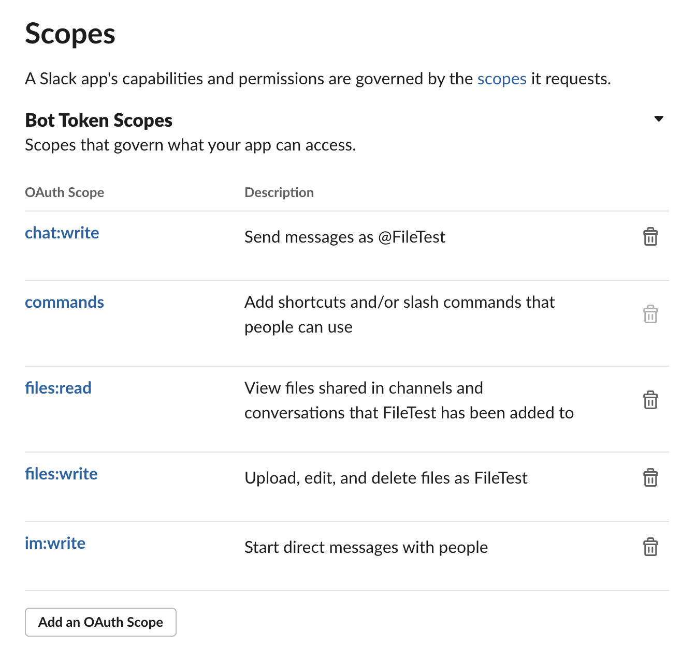
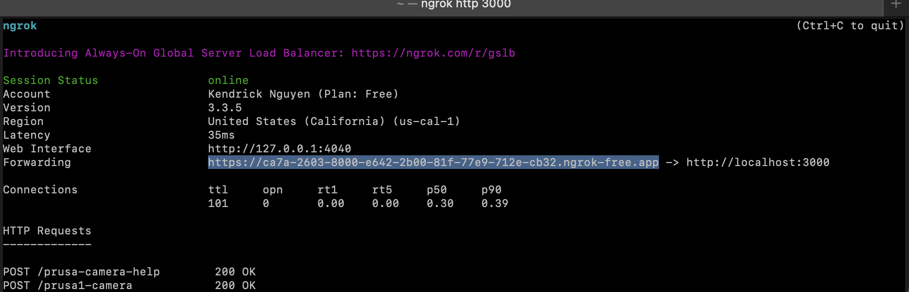
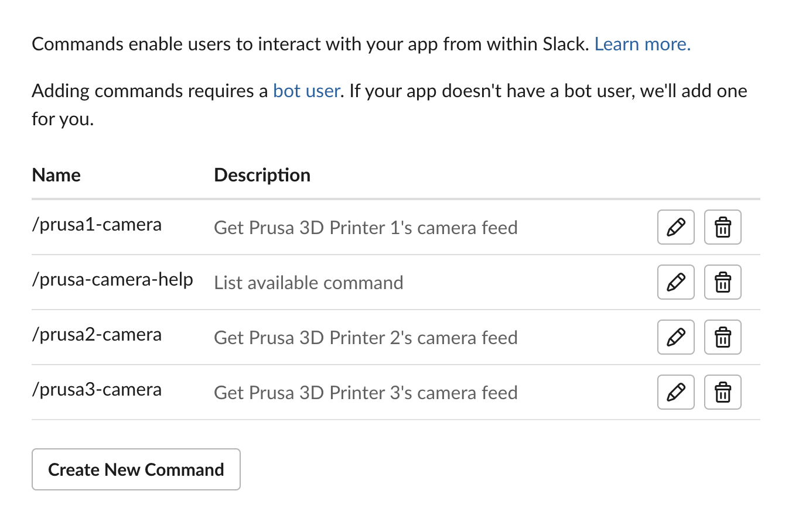

<p align="center">
  <h3 align="center">The Basement 3D-Printers Bot</h3>

  <p align="center">
    Slack Bot
    <br />   <br />
    <a href="https://github.com/github_username/repo_name"><strong>Explore the docs »</strong></a>
    <br />
    <br />
    <a href="https://github.com/github_username/repo_name">View Demo</a>
    ·
    <a href="https://github.com/github_username/repo_name/issues">Report Bug</a>
    ·
    <a href="https://github.com/github_username/repo_name/issues">Request Feature</a>
  </p>
</p>


<!-- TABLE OF CONTENTS -->
<details open="open">
  <summary><h2 style="display: inline-block">Table of Contents</h2></summary>
  <ol>
    <li>
      <a href="#about-the-project">About The Project</a>
      <ul>
        <li><a href="#built-with">Built With</a></li>
      </ul>
    </li>
    <li>
      <a href="#getting-started">Getting Started</a>
      <ul>
        <li><a href="#prerequisites">Prerequisites</a></li>
        <li><a href="#project-installation">Project Installation</a></li>
        <li><a href="#slack-bot-installation">Slack Bot Installation</a></li>
      </ul>
    </li>
    <li><a href="#usage">Usage</a></li>
    <li><a href="#file-architecture">File Architecture</a></li>
    <li><a href="#contact">Contact</a></li>
  </ol>
</details>


<!-- ABOUT THE PROJECT -->
## About The Project

The Basement 3D-printers occasionally experience failed print jobs, as inconvenient it can be for student teams working in the prototyping lab. Although simply re-running the print or performing quick maintanence on the printer can often fix these failures, it is often "too late" before teams or The
Basement technician can address the failure. The project is specifically seeking to remedy the issue by integrating a Slack bot to The Basement's Slack workspace to oversee prints when given a command. This solution allows teams and the technician to monitor The Basement 3D-printers from afar and quickly
discover potential print failures. Of course, this bot solution is scalable for other communication/notificaiton platforms as Slack is preferably used at The Basement.

### Built With

* [Raspberry Pi](https://www.raspberrypi.org/)
* [ngrok](https://ngrok.com/)
* [Slack API](https://api.slack.com/)
* [OpenCV](https://opencv.org/)
* [Flask](https://flask.palletsprojects.com/en/3.0.x/)


<!-- GETTING STARTED -->
## Getting Started

To get a local copy up and running follow these steps.

### Prerequisites

This project will be running on a Raspberry Pi. Set up your Raspberry Pi by installing the Raspberry Pi OS. If you are comfortable with using Linux, I
recommend downloading the Raspberry Pi OS Lite version. Here is a complete guide for installing the OS https://projects.raspberrypi.org/en/projects/raspberry-pi-setting-up.

Make sure you have the latest version of Python 3.11.* on your Raspberry Pi. This project uses the Slack API, ensure that you also have permission to The Basement workspace or to your own testing workspace. You are free to use any IDE for development, but [Visual Studio Code](https://code.visualstudio.com/) has many built-in functions to ease your workload. Highly recommend developing on this platform.

### Project Installation

1. Clone the repo
   ```sh
   git clone https://github.com/ucsdbasement/basement_3d_printers_bot.git
   ```

2. Download [ngrok](https://ngrok.com/download)

3. Install the following Python dependencies:
    - slackclient
    - flask
    - python-dotenv
    - opencv-python
    - Pillow

   or alternatively run,
   ```sh
   pip install -r requirements.txt
   ```

### Slack Bot Installation

1. Create a [new Slack app](https://api.slack.com/apps) and add it to your desired workspace.

2. In the OAuth & Permissions section, copy your Bot User OAuth Token and add it to an `.env` file. Likewise, in the Basic Information section,
find the Signing Secret credentials and add it to the `.env` file. The `.env` file should be located in the root directory of your repo with the following fields as shown.

    ```
    SLACK_BOT_TOKEN=<your bot token>
    SIGNING_SECRET=<your signing secret>
    ```

3. Our bot needs specific capabilities and permissions. In the OAuth & Permissions section, scroll down to Scopes and add the following permissions
    

4. On your terminal, we need to start a ngrok tunnel to forward Slack requests on the internet to our local web server. Run,
    ```
    ngrok http 3000
    ```

5. Once you have started an ngrok tunnel, copy the forwarding URL. Note, everytime you quit/run an ngrok tunnel again, the forwarding URL changes.
    

6. On the Slack app page, we need to create and enable slash commands. In the Slash Commands section, create four commands as shown.
    

   For each of these commands their Request URL is the ngrok forwarding URL appended with the slash command. For example, my forwarding URL is https://ca7a-2603-8000-e642-2b00-81f-77e9-712e-cb32.ngrok-free.app. 
   
   Then the Request URL for command `/prusa1-camera` is https://ca7a-2603-8000-e642-2b00-81f-77e9-712e-cb32.ngrok-free.app/prusa1-camera

7. Head to the Installed App Settings section and click the Reinstall to Workspace option.

<!-- USAGE EXAMPLES -->
## Usage

Run the `main.py` script and enter the availabe commands in any channel or conversation. The bot should respond to you with a `.gif` camera feed of your selected Prusa 3D-printer in a direct message.

Remember, everytime you quit/run an ngrok tunnel again, the forwarding URL changes. This means you would need to change the Request URL for all the commands on the Slack app page.

<!-- File Architecture -->
## File Architecture

```
[basement_3d_printers_bot]
├─ 📁frames
    ├─ 📁prusa_1
        ├─ 📄...
    ├─ 📁prusa_2
        ├─ 📄...
    ├─ 📁prusa_3
        ├─ 📄...
├─ 📁images
    ├─ 📄commands.png
    ├─ 📄ngrok.png
    ├─ 📄scopes.png
├─ 📄.env
├─ 📄.gitignore
├─ 📄README.md
├─ 📄frame.py
├─ 📄main.py
├─ 📄requirements.txt
```

<!-- CONTACT -->
## Contact

For any questions and issues, contact the current Basement student technician. 

This project was originally developed by [Kendrick Nguyen](https://github.com/kendrick010)